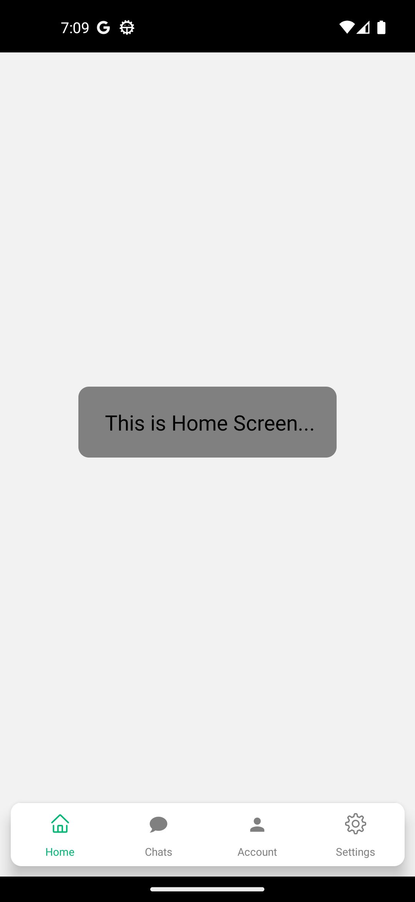
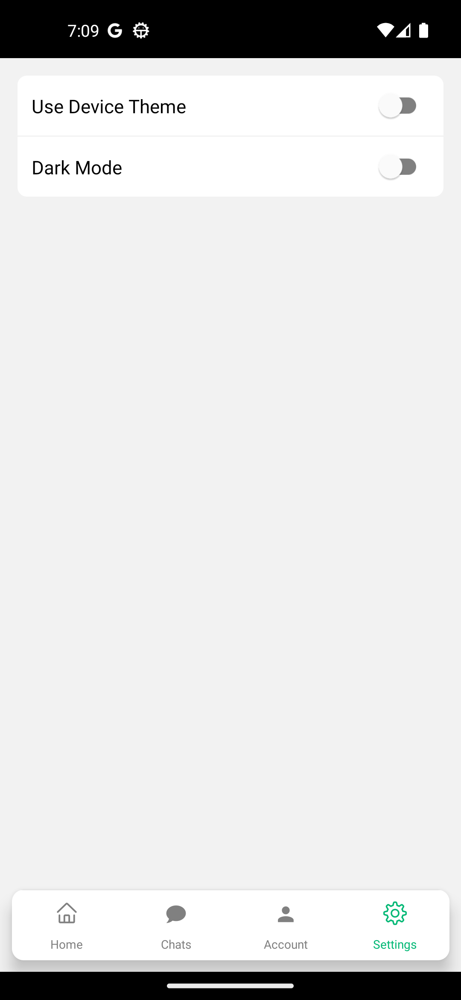
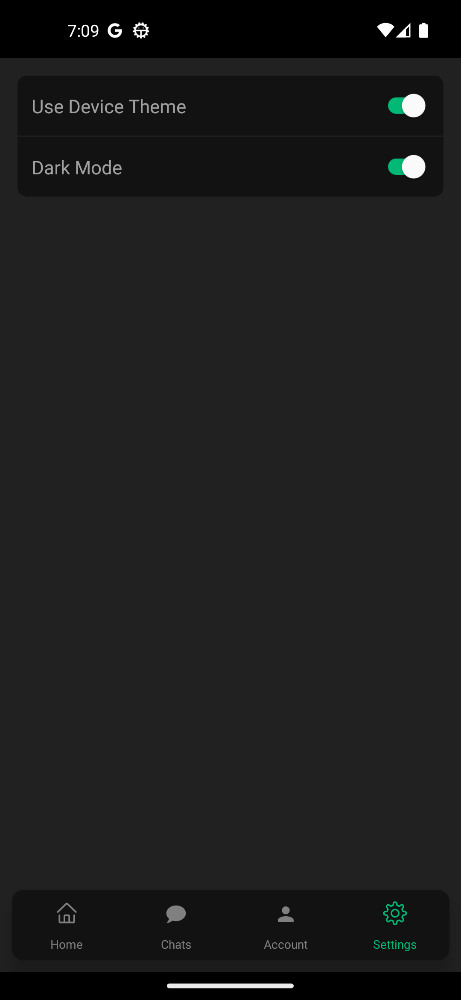

# DarkMode with React Native
You can use the system theme or choose dark mode with this project.
## ScreenShots

<div>
  <h3>Home Light</h3>
  
</div>
<div>
  <h3>Home Dark</h3>
  
</div>
<div>
  <h3>Settings Light</h3>
  
</div>
<div>
  <h3>Settings Dark</h3>
  
</div>

## Using Expo
```bash
   - go to app.json file
   - change "userInterfaceStyle": "light" --> "userInterfaceStyle": "automatic",
```

## Installation

Install my-project with npm

```bash
  git clone https://github.com/ebubekirkarakurt/react_native_darkmode.git
  cd react_native_darkmode
```
Install NPM packages
 
```bash
  npm install
```
Start metro server

```bash
  react-native run-android
  or
  react-native run-ios
```
